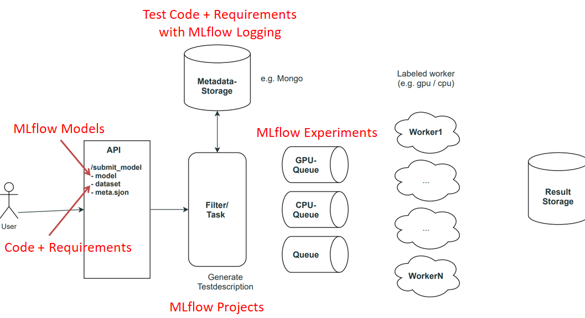

# Running Tests for Care Labels with MLflow

MLflow and its API can be used for running ML tests, as part of the bigger framework for generating ML care labels. This is a first software draft, the following framework schema shows where MLflow is utilized.

## Thoughts on MLflow

#### MLflow Models
- Stores ML models, dependencies, and meta information
- Stored and loaded with different _flavors_ => allows for different API uses!
- Flavors for PyTorch, Sklearn, ONNX, TensorFlow, pure Python, R, XGBoost, … already available
- Can be customized

#### Representing Tests and Data
- No clear API from MLflow available
- Code for running tests and loading data needs to be written by hand, and structured via directories
- Explicitly specify dependencies via requirements file
- Maybe make use of [DVC](https://dvc.org/) for datasets?

#### MLflow Projects
- Combine model, data and test into _MLflow Project_
- Collection of software and files => meta and environment information (Docker or Conda environment)
- Allows handling of parameters
- Can be easily executed

#### MLflow Experiments
- Each Project has a corresponding _Experiment_ => can be executed several times (so-called _runs_)
- Each run has designated log directory with artifacts
- Relevant care label information are parsed from artifacts

## Software

### Requirements
Tested on Linux with `Python 3.8.12` environment, library dependencies can be read from the [requirements](requirements.txt).

### Usage
Run [main.py](main.py). For the first time, this will also train the corresponding model, stored in `clflow/models`.

With a trained modelThe software will then create a new `clexperiment` (MLflow Project) directory for the combination, and also start a new run. For that it creates a new `conda`

## Open Questions
- How to handle exeuction platform (CPU, GPU, FPGA, …)
    - different models for platforms? Different (custom) flavors? 
    - What about different model versions? (Quantization!)
- Tests define how model is loaded (flavor) and data is used. Could this pose problems?
- What is the best way to merge requirements? 
- For easiest use, stick to Conda environments for now, or start with Docker?
- _"Outer loop" needs to define which tests need to be executed for a given model, and how results will be displayed (care labels)?
    - Combine with semantic tree of ML theory!
